# Enhanced Test Documentation System

## Overview

This system automatically generates Mermaid sequence diagrams from your Codeception test cases with **Git change tracking** to highlight recent modifications.

## 🎯 Key Features

### ✅ **Automated Generation**
- Converts Codeception test methods to Mermaid sequence diagrams
- Analyzes test patterns (`$I->amOnPage`, `$I->see`, etc.)
- Creates visual flow documentation

### 🔄 **Git Change Tracking**
- Highlights recently modified test files with 🔄 indicator
- Shows new test methods with 🆕 indicator  
- Orange highlighting for changed content
- Tracks last N commits (default: 5)

### 📊 **Multiple Diagram Types**
- **Individual Class Diagrams** - One per test class
- **Overview Diagram** - Complete test suite structure
- **Changelog Diagram** - Git timeline of recent changes

## 🚀 Usage

### Quick Commands
```bash
# Generate documentation only
./run-tests.sh docs
composer docs

# Run tests + generate docs automatically
./run-tests.sh test
./run-tests.sh acceptance
./run-tests.sh navigation

# Generate with custom commit history
./generate-docs.sh 10  # Check last 10 commits
```

### Advanced Usage
```bash
# Custom parameters
./generate-docs.sh [commits] [test_dir] [output_dir]

# Examples:
./generate-docs.sh 15 tests/Acceptance docs/test-diagrams
php scripts/generate-test-diagrams.php 7 tests/Integration docs/integration
```

## 📁 Generated Files

```
docs/diagrams/
├── README.md                    # Overview with change summary
├── overview.md                  # Complete test suite flowchart
├── changelog.md                 # Git timeline (if changes detected)
├── websitenavigationcest.md     # Navigation test sequence diagrams
└── databasestatuscest.md        # Database test sequence diagrams
```

## 🔧 Automation

### GitHub Actions Integration
- Automatically generates docs on every push/PR
- Uploads diagrams as build artifacts
- Uses last 10 commits for change tracking

### Local Development
- Auto-generation after running tests via `run-tests.sh`
- Composer script integration
- Configurable commit history depth

## 📖 Diagram Examples

### Sequence Diagram (with changes highlighted)

```mermaid
sequenceDiagram
    participant User
    participant Browser
    participant App as PHP App
    participant DB as Database

    %% Test: Navigate To About Us Page 🔄 MODIFIED
    rect rgb(255, 245, 230)
    Note over User,DB: Navigate To About Us Page 🔄 MODIFIED
    User->>Browser: Navigate to /about-us 🔄
    Browser->>App: HTTP Request
    App-->>Browser: Page Response
    Browser->>App: Verify text: About Us 🔄
    App-->>Browser: Validation Result
    end
```


### Overview Flowchart (with change indicators)

```mermaid
flowchart TD
    Start([Test Suite Start])
    WebsiteNavigation[Website Navigation 🔄<br/>47 steps, 3 modified]
    DatabaseStatus[Database Status<br/>46 steps]
    
    style WebsiteNavigation fill:#fff5e6,stroke:#ff8c00,stroke-width:2px
    
    Start --> WebsiteNavigation
    Start --> DatabaseStatus
```


## 🎨 Visual Indicators

| Symbol | Meaning |
|--------|---------|
| 🔄 | Recently modified (in tracked commits) |
| 🆕 | New test method |
| 🟠 Orange background | Changed test sections |
| 📊 | Contains change tracking info |

## ⚙️ Configuration

### Change Tracking Settings
- **Default commits checked**: 5
- **Customizable via command line**: `./generate-docs.sh 15`
- **GitHub Actions**: Uses 10 commits
- **Auto-detection**: Skips change tracking if not in Git repo

### File Patterns Detected
- Test file changes: `tests/**/*Cest.php`
- Method pattern matching for new/modified tests
- Git diff analysis for line-by-line changes

## 🔄 Integration Points

### With Testing Framework
```bash
# After running tests, docs are automatically generated
./run-tests.sh test        # Runs tests + generates docs
./run-tests.sh acceptance  # Runs acceptance tests + generates docs
```

### With CI/CD Pipeline
```yaml
# GitHub Actions automatically:
- name: Generate test documentation
  run: ./generate-docs.sh 10

- name: Upload test documentation
  uses: actions/upload-artifact@v4
  with:
    name: test-documentation
    path: docs/diagrams/
```

### With Development Workflow
1. **Write/modify tests** in `tests/Acceptance/`
2. **Run tests** with `./run-tests.sh test`
3. **View generated docs** in `docs/diagrams/`
4. **Commit changes** - docs show change highlights
5. **Push to GitHub** - Actions regenerate with full history

## 🎯 Benefits

### For Development Teams
- **Visual test documentation** - Easy to understand test flows
- **Change tracking** - See what tests were recently modified
- **Onboarding** - New team members can quickly understand test structure
- **Code reviews** - Visual representation of test changes

### For Documentation
- **Always up-to-date** - Regenerated automatically
- **Mermaid compatible** - Works with GitHub, GitLab, Notion, etc.
- **Self-documenting** - No manual diagram maintenance needed
- **Change history** - Visual timeline of test evolution

---

**🎉 Your test documentation now automatically highlights changes and stays current with your codebase!**
