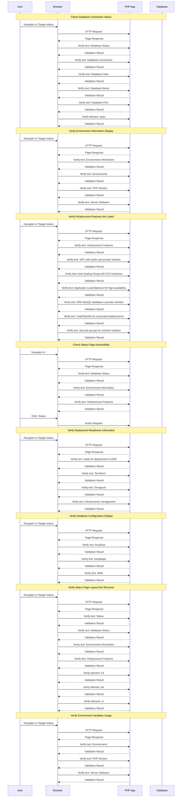

# DatabaseStatusCest Test Flow

This diagram shows the test flow for DatabaseStatusCest.

```mermaid
sequenceDiagram
    participant User
    participant Browser
    participant App as PHP App
    participant DB as Database

    %% Test: Check Database Connection Status
    Note over User,DB: Check Database Connection Status
    User->>Browser: Navigate to /?page=status
    Browser->>App: HTTP Request
    App-->>Browser: Page Response
    Browser->>App: Verify text: Database Status
    App-->>Browser: Validation Result
    Browser->>App: Verify text: Database Connection:
    App-->>Browser: Validation Result
    Browser->>App: Verify text: Database Host:
    App-->>Browser: Validation Result
    Browser->>App: Verify text: Database Name:
    App-->>Browser: Validation Result
    Browser->>App: Verify text: Database Port:
    App-->>Browser: Validation Result
    Browser->>App: Verify element: span
    App-->>Browser: Validation Result

    %% Test: Verify Environment Information Display
    Note over User,DB: Verify Environment Information Display
    User->>Browser: Navigate to /?page=status
    Browser->>App: HTTP Request
    App-->>Browser: Page Response
    Browser->>App: Verify text: Environment Information
    App-->>Browser: Validation Result
    Browser->>App: Verify text: Environment:
    App-->>Browser: Validation Result
    Browser->>App: Verify text: PHP Version:
    App-->>Browser: Validation Result
    Browser->>App: Verify text: Server Software:
    App-->>Browser: Validation Result

    %% Test: Verify Infrastructure Features Are Listed
    Note over User,DB: Verify Infrastructure Features Are Listed
    User->>Browser: Navigate to /?page=status
    Browser->>App: HTTP Request
    App-->>Browser: Page Response
    Browser->>App: Verify text: Infrastructure Features
    App-->>Browser: Validation Result
    Browser->>App: Verify text: VPC with public and private subnets
    App-->>Browser: Validation Result
    Browser->>App: Verify text: Auto Scaling Group with EC2 instances
    App-->>Browser: Validation Result
    Browser->>App: Verify text: Application Load Balancer for high availability
    App-->>Browser: Validation Result
    Browser->>App: Verify text: RDS MySQL database in private subnets
    App-->>Browser: Validation Result
    Browser->>App: Verify text: CodePipeline for automated deployments
    App-->>Browser: Validation Result
    Browser->>App: Verify text: Security groups for network isolation
    App-->>Browser: Validation Result

    %% Test: Check Status Page Accessibility
    Note over User,DB: Check Status Page Accessibility
    User->>Browser: Navigate to /
    Browser->>App: HTTP Request
    App-->>Browser: Page Response
    Browser->>App: Verify text: Database Status
    App-->>Browser: Validation Result
    Browser->>App: Verify text: Environment Information
    App-->>Browser: Validation Result
    Browser->>App: Verify text: Infrastructure Features
    App-->>Browser: Validation Result
    User->>Browser: Click: Status
    Browser->>App: Action Request

    %% Test: Verify Deployment Readiness Information
    Note over User,DB: Verify Deployment Readiness Information
    User->>Browser: Navigate to /?page=status
    Browser->>App: HTTP Request
    App-->>Browser: Page Response
    Browser->>App: Verify text: ready for deployment to AWS
    App-->>Browser: Validation Result
    Browser->>App: Verify text: Terraform
    App-->>Browser: Validation Result
    Browser->>App: Verify text: Terragrunt
    App-->>Browser: Validation Result
    Browser->>App: Verify text: infrastructure management
    App-->>Browser: Validation Result

    %% Test: Verify Database Configuration Display
    Note over User,DB: Verify Database Configuration Display
    User->>Browser: Navigate to /?page=status
    Browser->>App: HTTP Request
    App-->>Browser: Page Response
    Browser->>App: Verify text: localhost
    App-->>Browser: Validation Result
    Browser->>App: Verify text: simpleapp
    App-->>Browser: Validation Result
    Browser->>App: Verify text: 3306
    App-->>Browser: Validation Result

    %% Test: Verify Status Page Layout And Structure
    Note over User,DB: Verify Status Page Layout And Structure
    User->>Browser: Navigate to /?page=status
    Browser->>App: HTTP Request
    App-->>Browser: Page Response
    Browser->>App: Verify text: Status
    App-->>Browser: Validation Result
    Browser->>App: Verify text: Database Status
    App-->>Browser: Validation Result
    Browser->>App: Verify text: Environment Information
    App-->>Browser: Validation Result
    Browser->>App: Verify text: Infrastructure Features
    App-->>Browser: Validation Result
    Browser->>App: Verify element: h3
    App-->>Browser: Validation Result
    Browser->>App: Verify element: div
    App-->>Browser: Validation Result
    Browser->>App: Verify element: ul
    App-->>Browser: Validation Result

    %% Test: Verify Environment Variables Usage
    Note over User,DB: Verify Environment Variables Usage
    User->>Browser: Navigate to /?page=status
    Browser->>App: HTTP Request
    App-->>Browser: Page Response
    Browser->>App: Verify text: Environment:
    App-->>Browser: Validation Result
    Browser->>App: Verify text: PHP Version:
    App-->>Browser: Validation Result
    Browser->>App: Verify text: Server Software:
    App-->>Browser: Validation Result

```
