# Test Suite Overview

This diagram shows the complete test suite structure.

## Recent Changes

Last 10 commits (excluding auto-generated):
- `dedc213 Added Testing page to test doc generation`
- `7867799 AI changes`
- `2be8ed8 Added one page for testing`
- `d557fd2 Cleanup`
- `4b4007a Added last page for testing`
- `73d78bb More changes to fix the highlighting`
- `ac5649b Added onemore page to test`
- `8c99884 Updated docs`
- `571145c New page and testcases added for final`
- `e0b9f7d Fixed the highlighting`

🔄 Orange highlighted items indicate recent modifications.

```mermaid
flowchart TD
    Start([Test Suite Start])
    DatabaseStatus[DatabaseStatus<br/>46 steps]
    Start --> DatabaseStatus
    DatabaseStatus_checkDatabaseConnectionStatus[Check Database Connection Status]
    DatabaseStatus --> DatabaseStatus_checkDatabaseConnectionStatus
    DatabaseStatus_verifyEnvironmentInformationDisplay[Verify Environment Information Display]
    DatabaseStatus --> DatabaseStatus_verifyEnvironmentInformationDisplay
    DatabaseStatus_verifyInfrastructureFeaturesAreListed[Verify Infrastructure Features Are Listed]
    DatabaseStatus --> DatabaseStatus_verifyInfrastructureFeaturesAreListed
    DatabaseStatus_checkStatusPageAccessibility[Check Status Page Accessibility]
    DatabaseStatus --> DatabaseStatus_checkStatusPageAccessibility
    DatabaseStatus_verifyDeploymentReadinessInformation[Verify Deployment Readiness Information]
    DatabaseStatus --> DatabaseStatus_verifyDeploymentReadinessInformation
    DatabaseStatus_verifyDatabaseConfigurationDisplay[Verify Database Configuration Display]
    DatabaseStatus --> DatabaseStatus_verifyDatabaseConfigurationDisplay
    DatabaseStatus_verifyStatusPageLayoutAndStructure[Verify Status Page Layout And Structure]
    DatabaseStatus --> DatabaseStatus_verifyStatusPageLayoutAndStructure
    DatabaseStatus_verifyEnvironmentVariablesUsage[Verify Environment Variables Usage]
    DatabaseStatus --> DatabaseStatus_verifyEnvironmentVariablesUsage
    WebsiteNavigation[WebsiteNavigation 🔄<br/>51 steps, 2 modified]
    style WebsiteNavigation fill:#fff5e6,stroke:#ff8c00,stroke-width:2px
    Start --> WebsiteNavigation
    WebsiteNavigation_displayHomePageByDefault[Display Home Page By Default]
    WebsiteNavigation --> WebsiteNavigation_displayHomePageByDefault
    WebsiteNavigation_navigateToAboutUsPage[Navigate To About Us Page]
    WebsiteNavigation --> WebsiteNavigation_navigateToAboutUsPage
    WebsiteNavigation_navigateToProductsPage[Navigate To Products Page]
    WebsiteNavigation --> WebsiteNavigation_navigateToProductsPage
    WebsiteNavigation_navigateToContactPage[Navigate To Contact Page]
    WebsiteNavigation --> WebsiteNavigation_navigateToContactPage
    WebsiteNavigation_navigateToCheckingPage[Navigate To Checking Page]
    WebsiteNavigation --> WebsiteNavigation_navigateToCheckingPage
    WebsiteNavigation_navigateToTestingPage[Navigate To Testing Page]
    WebsiteNavigation --> WebsiteNavigation_navigateToTestingPage
    WebsiteNavigation_accessStatusPageWithSystemInformation[Access Status Page With System Information]
    WebsiteNavigation --> WebsiteNavigation_accessStatusPageWithSystemInformation
    WebsiteNavigation_handleNonExistentPageWith404Error[Handle Non Existent Page With404Error]
    WebsiteNavigation --> WebsiteNavigation_handleNonExistentPageWith404Error
    WebsiteNavigation_verifyNavigationMenuIsPresentOnAllPages[Verify Navigation Menu Is Present On All Pages]
    WebsiteNavigation --> WebsiteNavigation_verifyNavigationMenuIsPresentOnAllPages
    WebsiteNavigation_verifyWebsiteFooterInformation[Verify Website Footer Information]
    WebsiteNavigation --> WebsiteNavigation_verifyWebsiteFooterInformation
    WebsiteNavigation_verifyActiveNavigationState[Verify Active Navigation State]
    WebsiteNavigation --> WebsiteNavigation_verifyActiveNavigationState
    WebsiteNavigation_verifyPageStructureConsistency[Verify Page Structure Consistency]
    WebsiteNavigation --> WebsiteNavigation_verifyPageStructureConsistency
    End([Test Suite End])
    DatabaseStatus_checkDatabaseConnectionStatus --> End
    DatabaseStatus_verifyEnvironmentInformationDisplay --> End
    DatabaseStatus_verifyInfrastructureFeaturesAreListed --> End
    DatabaseStatus_checkStatusPageAccessibility --> End
    DatabaseStatus_verifyDeploymentReadinessInformation --> End
    DatabaseStatus_verifyDatabaseConfigurationDisplay --> End
    DatabaseStatus_verifyStatusPageLayoutAndStructure --> End
    DatabaseStatus_verifyEnvironmentVariablesUsage --> End
    WebsiteNavigation_displayHomePageByDefault --> End
    WebsiteNavigation_navigateToAboutUsPage --> End
    WebsiteNavigation_navigateToProductsPage --> End
    WebsiteNavigation_navigateToContactPage --> End
    WebsiteNavigation_navigateToCheckingPage --> End
    WebsiteNavigation_navigateToTestingPage --> End
    WebsiteNavigation_accessStatusPageWithSystemInformation --> End
    WebsiteNavigation_handleNonExistentPageWith404Error --> End
    WebsiteNavigation_verifyNavigationMenuIsPresentOnAllPages --> End
    WebsiteNavigation_verifyWebsiteFooterInformation --> End
    WebsiteNavigation_verifyActiveNavigationState --> End
    WebsiteNavigation_verifyPageStructureConsistency --> End
```

