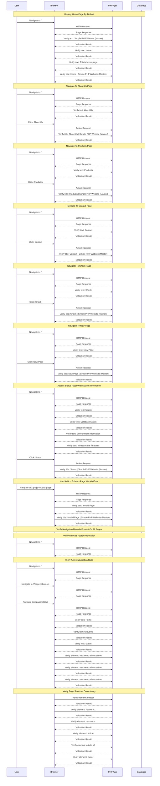

# WebsiteNavigationCest Test Flow

This diagram shows the test flow for WebsiteNavigationCest.

```mermaid
sequenceDiagram
    participant User
    participant Browser
    participant App as PHP App
    participant DB as Database

    %% Test: Display Home Page By Default
    Note over User,DB: Display Home Page By Default
    User->>Browser: Navigate to /
    Browser->>App: HTTP Request
    App-->>Browser: Page Response
    Browser->>App: Verify text: Simple PHP Website (Master)
    App-->>Browser: Validation Result
    Browser->>App: Verify text: Home
    App-->>Browser: Validation Result
    Browser->>App: Verify text: This is home page
    App-->>Browser: Validation Result
    Browser->>App: Verify title: Home | Simple PHP Website (Master)
    App-->>Browser: Validation Result

    %% Test: Navigate To About Us Page
    Note over User,DB: Navigate To About Us Page
    User->>Browser: Navigate to /
    Browser->>App: HTTP Request
    App-->>Browser: Page Response
    Browser->>App: Verify text: About Us
    App-->>Browser: Validation Result
    User->>Browser: Click: About Us
    Browser->>App: Action Request
    Browser->>App: Verify title: About Us | Simple PHP Website (Master)
    App-->>Browser: Validation Result

    %% Test: Navigate To Products Page
    Note over User,DB: Navigate To Products Page
    User->>Browser: Navigate to /
    Browser->>App: HTTP Request
    App-->>Browser: Page Response
    Browser->>App: Verify text: Products
    App-->>Browser: Validation Result
    User->>Browser: Click: Products
    Browser->>App: Action Request
    Browser->>App: Verify title: Products | Simple PHP Website (Master)
    App-->>Browser: Validation Result

    %% Test: Navigate To Contact Page
    Note over User,DB: Navigate To Contact Page
    User->>Browser: Navigate to /
    Browser->>App: HTTP Request
    App-->>Browser: Page Response
    Browser->>App: Verify text: Contact
    App-->>Browser: Validation Result
    User->>Browser: Click: Contact
    Browser->>App: Action Request
    Browser->>App: Verify title: Contact | Simple PHP Website (Master)
    App-->>Browser: Validation Result

    %% Test: Navigate To Check Page
    Note over User,DB: Navigate To Check Page
    User->>Browser: Navigate to /
    Browser->>App: HTTP Request
    App-->>Browser: Page Response
    Browser->>App: Verify text: Check
    App-->>Browser: Validation Result
    User->>Browser: Click: Check
    Browser->>App: Action Request
    Browser->>App: Verify title: Check | Simple PHP Website (Master)
    App-->>Browser: Validation Result

    %% Test: Navigate To New Page
    Note over User,DB: Navigate To New Page
    User->>Browser: Navigate to /
    Browser->>App: HTTP Request
    App-->>Browser: Page Response
    Browser->>App: Verify text: New Page
    App-->>Browser: Validation Result
    User->>Browser: Click: New Page
    Browser->>App: Action Request
    Browser->>App: Verify title: New Page | Simple PHP Website (Master)
    App-->>Browser: Validation Result

    %% Test: Access Status Page With System Information
    Note over User,DB: Access Status Page With System Information
    User->>Browser: Navigate to /
    Browser->>App: HTTP Request
    App-->>Browser: Page Response
    Browser->>App: Verify text: Status
    App-->>Browser: Validation Result
    Browser->>App: Verify text: Database Status
    App-->>Browser: Validation Result
    Browser->>App: Verify text: Environment Information
    App-->>Browser: Validation Result
    Browser->>App: Verify text: Infrastructure Features
    App-->>Browser: Validation Result
    User->>Browser: Click: Status
    Browser->>App: Action Request
    Browser->>App: Verify title: Status | Simple PHP Website (Master)
    App-->>Browser: Validation Result

    %% Test: Handle Non Existent Page With404Error
    Note over User,DB: Handle Non Existent Page With404Error
    User->>Browser: Navigate to /?page=invalid-page
    Browser->>App: HTTP Request
    App-->>Browser: Page Response
    Browser->>App: Verify text: Invalid Page
    App-->>Browser: Validation Result
    Browser->>App: Verify title: Invalid Page | Simple PHP Website (Master)
    App-->>Browser: Validation Result

    %% Test: Verify Navigation Menu Is Present On All Pages
    Note over User,DB: Verify Navigation Menu Is Present On All Pages

    %% Test: Verify Website Footer Information
    Note over User,DB: Verify Website Footer Information
    User->>Browser: Navigate to /
    Browser->>App: HTTP Request
    App-->>Browser: Page Response

    %% Test: Verify Active Navigation State
    Note over User,DB: Verify Active Navigation State
    User->>Browser: Navigate to /
    Browser->>App: HTTP Request
    App-->>Browser: Page Response
    User->>Browser: Navigate to /?page=about-us
    Browser->>App: HTTP Request
    App-->>Browser: Page Response
    User->>Browser: Navigate to /?page=status
    Browser->>App: HTTP Request
    App-->>Browser: Page Response
    Browser->>App: Verify text: Home
    App-->>Browser: Validation Result
    Browser->>App: Verify text: About Us
    App-->>Browser: Validation Result
    Browser->>App: Verify text: Status
    App-->>Browser: Validation Result
    Browser->>App: Verify element: nav.menu a.item.active
    App-->>Browser: Validation Result
    Browser->>App: Verify element: nav.menu a.item.active
    App-->>Browser: Validation Result
    Browser->>App: Verify element: nav.menu a.item.active
    App-->>Browser: Validation Result

    %% Test: Verify Page Structure Consistency
    Note over User,DB: Verify Page Structure Consistency
    Browser->>App: Verify element: header
    App-->>Browser: Validation Result
    Browser->>App: Verify element: header h1
    App-->>Browser: Validation Result
    Browser->>App: Verify element: nav.menu
    App-->>Browser: Validation Result
    Browser->>App: Verify element: article
    App-->>Browser: Validation Result
    Browser->>App: Verify element: article h2
    App-->>Browser: Validation Result
    Browser->>App: Verify element: footer
    App-->>Browser: Validation Result

```
