# WebsiteNavigationCest Test Flow

🔄 **This test class was recently modified**

This diagram shows the test flow for WebsiteNavigationCest.

## Legend
- 🆕 **NEW** - Recently added test method
- 🔄 **MODIFIED** - Recently changed test method
- Orange background - Indicates recent changes

```mermaid
sequenceDiagram
    participant User
    participant Browser
    participant App as PHP App
    participant DB as Database

    Note over User,DB: 🔄 RECENTLY MODIFIED

    %% Test: Display Home Page By Default 🆕 NEW
    rect rgb(255, 245, 230)
    Note over User,DB: Display Home Page By Default 🆕 NEW
    User->>Browser: Navigate to / 🔄
    Browser->>App: HTTP Request
    App-->>Browser: Page Response
    Browser->>App: Verify text: Simple PHP Website (Master) 🔄
    App-->>Browser: Validation Result
    Browser->>App: Verify text: Home 🔄
    App-->>Browser: Validation Result
    Browser->>App: Verify text: This is home page 🔄
    App-->>Browser: Validation Result
    Browser->>App: Verify title: Home | Simple PHP Website (Master) 🔄
    App-->>Browser: Validation Result
    end

    %% Test: Navigate To About Us Page 🆕 NEW
    rect rgb(255, 245, 230)
    Note over User,DB: Navigate To About Us Page 🆕 NEW
    User->>Browser: Navigate to / 🔄
    Browser->>App: HTTP Request
    App-->>Browser: Page Response
    Browser->>App: Verify text: About Us 🔄
    App-->>Browser: Validation Result
    User->>Browser: Click: About Us 🔄
    Browser->>App: Action Request
    Browser->>App: Verify title: About Us | Simple PHP Website (Master) 🔄
    App-->>Browser: Validation Result
    end

    %% Test: Navigate To Products Page 🆕 NEW
    rect rgb(255, 245, 230)
    Note over User,DB: Navigate To Products Page 🆕 NEW
    User->>Browser: Navigate to / 🔄
    Browser->>App: HTTP Request
    App-->>Browser: Page Response
    Browser->>App: Verify text: Products 🔄
    App-->>Browser: Validation Result
    User->>Browser: Click: Products 🔄
    Browser->>App: Action Request
    Browser->>App: Verify title: Products | Simple PHP Website (Master) 🔄
    App-->>Browser: Validation Result
    end

    %% Test: Navigate To Contact Page 🆕 NEW
    rect rgb(255, 245, 230)
    Note over User,DB: Navigate To Contact Page 🆕 NEW
    User->>Browser: Navigate to / 🔄
    Browser->>App: HTTP Request
    App-->>Browser: Page Response
    Browser->>App: Verify text: Contact 🔄
    App-->>Browser: Validation Result
    User->>Browser: Click: Contact 🔄
    Browser->>App: Action Request
    Browser->>App: Verify title: Contact | Simple PHP Website (Master) 🔄
    App-->>Browser: Validation Result
    end

    %% Test: Navigate To Check Page 🆕 NEW
    rect rgb(255, 245, 230)
    Note over User,DB: Navigate To Check Page 🆕 NEW
    User->>Browser: Navigate to / 🔄
    Browser->>App: HTTP Request
    App-->>Browser: Page Response
    Browser->>App: Verify text: Check 🔄
    App-->>Browser: Validation Result
    User->>Browser: Click: Check 🔄
    Browser->>App: Action Request
    Browser->>App: Verify title: Check | Simple PHP Website (Master) 🔄
    App-->>Browser: Validation Result
    end

    %% Test: Navigate To New Page 🆕 NEW
    rect rgb(255, 245, 230)
    Note over User,DB: Navigate To New Page 🆕 NEW
    User->>Browser: Navigate to / 🔄
    Browser->>App: HTTP Request
    App-->>Browser: Page Response
    Browser->>App: Verify text: Newpage 🔄
    App-->>Browser: Validation Result
    User->>Browser: Click: Newpage 🔄
    Browser->>App: Action Request
    Browser->>App: Verify title: Newpage | Simple PHP Website (Master) 🔄
    App-->>Browser: Validation Result
    end

    %% Test: Navigate To Final Page 🆕 NEW
    rect rgb(255, 245, 230)
    Note over User,DB: Navigate To Final Page 🆕 NEW
    User->>Browser: Navigate to / 🔄
    Browser->>App: HTTP Request
    App-->>Browser: Page Response
    Browser->>App: Verify text: Final 🔄
    App-->>Browser: Validation Result
    User->>Browser: Click: Final 🔄
    Browser->>App: Action Request
    Browser->>App: Verify title: Final | Simple PHP Website (Master) 🔄
    App-->>Browser: Validation Result
    end

    %% Test: Access Status Page With System Information 🆕 NEW
    rect rgb(255, 245, 230)
    Note over User,DB: Access Status Page With System Information 🆕 NEW
    User->>Browser: Navigate to / 🔄
    Browser->>App: HTTP Request
    App-->>Browser: Page Response
    Browser->>App: Verify text: Status 🔄
    App-->>Browser: Validation Result
    Browser->>App: Verify text: Database Status 🔄
    App-->>Browser: Validation Result
    Browser->>App: Verify text: Environment Information 🔄
    App-->>Browser: Validation Result
    Browser->>App: Verify text: Infrastructure Features 🔄
    App-->>Browser: Validation Result
    User->>Browser: Click: Status 🔄
    Browser->>App: Action Request
    Browser->>App: Verify title: Status | Simple PHP Website (Master) 🔄
    App-->>Browser: Validation Result
    end

    %% Test: Handle Non Existent Page With404Error
    Note over User,DB: Handle Non Existent Page With404Error
    User->>Browser: Navigate to /?page=invalid-page
    Browser->>App: HTTP Request
    App-->>Browser: Page Response
    Browser->>App: Verify text: Invalid Page
    App-->>Browser: Validation Result
    Browser->>App: Verify title: Invalid Page | Simple PHP Website (Master)
    App-->>Browser: Validation Result

    %% Test: Verify Navigation Menu Is Present On All Pages
    Note over User,DB: Verify Navigation Menu Is Present On All Pages

    %% Test: Verify Website Footer Information 🆕 NEW
    rect rgb(255, 245, 230)
    Note over User,DB: Verify Website Footer Information 🆕 NEW
    User->>Browser: Navigate to / 🔄
    Browser->>App: HTTP Request
    App-->>Browser: Page Response
    end

    %% Test: Verify Active Navigation State 🆕 NEW
    rect rgb(255, 245, 230)
    Note over User,DB: Verify Active Navigation State 🆕 NEW
    User->>Browser: Navigate to / 🔄
    Browser->>App: HTTP Request
    App-->>Browser: Page Response
    User->>Browser: Navigate to /?page=about-us 🔄
    Browser->>App: HTTP Request
    App-->>Browser: Page Response
    User->>Browser: Navigate to /?page=status 🔄
    Browser->>App: HTTP Request
    App-->>Browser: Page Response
    Browser->>App: Verify text: Home 🔄
    App-->>Browser: Validation Result
    Browser->>App: Verify text: About Us 🔄
    App-->>Browser: Validation Result
    Browser->>App: Verify text: Status 🔄
    App-->>Browser: Validation Result
    Browser->>App: Verify element: nav.menu a.item.active 🔄
    App-->>Browser: Validation Result
    Browser->>App: Verify element: nav.menu a.item.active 🔄
    App-->>Browser: Validation Result
    Browser->>App: Verify element: nav.menu a.item.active 🔄
    App-->>Browser: Validation Result
    end

    %% Test: Verify Page Structure Consistency
    Note over User,DB: Verify Page Structure Consistency
    Browser->>App: Verify element: header
    App-->>Browser: Validation Result
    Browser->>App: Verify element: header h1
    App-->>Browser: Validation Result
    Browser->>App: Verify element: nav.menu
    App-->>Browser: Validation Result
    Browser->>App: Verify element: article
    App-->>Browser: Validation Result
    Browser->>App: Verify element: article h2
    App-->>Browser: Validation Result
    Browser->>App: Verify element: footer
    App-->>Browser: Validation Result

```

